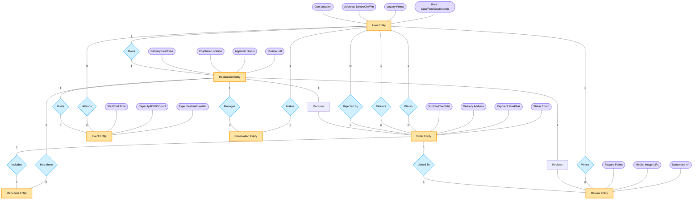

# Project ER Diagram (Master Version)

This diagram represents the full database schema for the Integrated Food Delivery and Dine-Out Platform.

```mermaid
flowchart TD
    %% --- ENTITIES (Yellow Rectangles) ---
    User[User Entity]
    Restaurant[Restaurant Entity]
    Order[Order Entity]
    MenuItem[MenuItem Entity]
    Review[Review Entity]
    Event[Event Entity]
    Reservation[Reservation Entity]

    %% --- RELATIONSHIPS (Blue Diamonds) ---
    Owns{Owns}
    Places{Places}
    Delivers{Delivers}
    Rejects{Rejected By}
    Menu{Has Menu}
    Items{Includes}
    Feedback{Writes}
    LinkedTo{Linked To}
    Hosts{Hosts}
    Attends{Attends}
    Booked{Makes}
    Manages{Manages}

    %% --- ATTRIBUTES (Purple Ovals) ---
    %% User Attributes
    U1([Role: Cust/Rest/Cour/Admin]) --- User
    U2([Loyalty Points]) --- User
    U3([Address: Street/City/Pin]) --- User
    U4([Geo-Location]) --- User

    %% Restaurant Attributes
    R1([Cuisine List]) --- Restaurant
    R2([Approval Status]) --- Restaurant
    R3([2dsphere Location]) --- Restaurant
    R4([Delivery Fee/Time]) --- Restaurant

    %% Order Attributes
    O1([Status Enum]) --- Order
    O2([Payment: Paid/Fail]) --- Order
    O3([Delivery Address]) --- Order
    O4([Subtotal/Tax/Total]) --- Order

    %% Review Attributes
    Rev1([Sentiment: +/-]) --- Review
    Rev2([Media: Image URL]) --- Review
    Rev3([Reward Points]) --- Review

    %% Event Attributes
    E1([Type: Festival/Live/etc]) --- Event
    E2([Capacity/RSVP Count]) --- Event
    E3([Start/End Time]) --- Event

    %% --- CONNECTIONS ---
    User ---|1| Owns ---|1| Restaurant
    User ---|1| Places ---|n| Order
    User ---|1| Delivers ---|n| Order
    User ---|m| Rejects ---|n| Order
    User ---|1| Feedback ---|n| Review
    User ---|m| Attends ---|n| Event
    User ---|1| Booked ---|n| Reservation

    Restaurant ---|1| Menu ---|n| MenuItem
    Restaurant ---|1| Receives --- Order
    Restaurant ---|1| Hosts ---|n| Event
    Restaurant ---|1| Manages ---|n| Reservation
    Restaurant ---|1| Reviews --- Review

    Order ---|1| LinkedTo ---|1| Review
    Order ---|n| Items ---|n| MenuItem

    %% --- STYLING (Boardmix Look) ---
    style User fill:#ffe4a3,stroke:#ff9b00,stroke-width:3px,color:#000
    style Restaurant fill:#ffe4a3,stroke:#ff9b00,stroke-width:3px,color:#000
    style Order fill:#ffe4a3,stroke:#ff9b00,stroke-width:3px,color:#000
    style MenuItem fill:#ffe4a3,stroke:#ff9b00,stroke-width:3px,color:#000
    style Review fill:#ffe4a3,stroke:#ff9b00,stroke-width:3px,color:#000
    style Event fill:#ffe4a3,stroke:#ff9b00,stroke-width:3px,color:#000
    style Reservation fill:#ffe4a3,stroke:#ff9b00,stroke-width:3px,color:#000

    style Owns fill:#d1f0ff,stroke:#00a2ff,stroke-width:2px,color:#000
    style Places fill:#d1f0ff,stroke:#00a2ff,stroke-width:2px,color:#000
    style Delivers fill:#d1f0ff,stroke:#00a2ff,stroke-width:2px,color:#000
    style Rejects fill:#d1f0ff,stroke:#00a2ff,stroke-width:2px,color:#000
    style Menu fill:#d1f0ff,stroke:#00a2ff,stroke-width:2px,color:#000
    style Items fill:#d1f0ff,stroke:#00a2ff,stroke-width:2px,color:#000
    style Feedback fill:#d1f0ff,stroke:#00a2ff,stroke-width:2px,color:#000
    style LinkedTo fill:#d1f0ff,stroke:#00a2ff,stroke-width:2px,color:#000
    style Hosts fill:#d1f0ff,stroke:#00a2ff,stroke-width:2px,color:#000
    style Attends fill:#d1f0ff,stroke:#00a2ff,stroke-width:2px,color:#000
    style Booked fill:#d1f0ff,stroke:#00a2ff,stroke-width:2px,color:#000
    style Manages fill:#d1f0ff,stroke:#00a2ff,stroke-width:2px,color:#000

    style U1 fill:#e1dbff,stroke:#7c5dfa,color:#000
    style U2 fill:#e1dbff,stroke:#7c5dfa,color:#000
    style U3 fill:#e1dbff,stroke:#7c5dfa,color:#000
    style U4 fill:#e1dbff,stroke:#7c5dfa,color:#000
    style R1 fill:#e1dbff,stroke:#7c5dfa,color:#000
    style R2 fill:#e1dbff,stroke:#7c5dfa,color:#000
    style R3 fill:#e1dbff,stroke:#7c5dfa,color:#000
    style R4 fill:#e1dbff,stroke:#7c5dfa,color:#000
    style O1 fill:#e1dbff,stroke:#7c5dfa,color:#000
    style O2 fill:#e1dbff,stroke:#7c5dfa,color:#000
    style O3 fill:#e1dbff,stroke:#7c5dfa,color:#000
    style O4 fill:#e1dbff,stroke:#7c5dfa,color:#000
    style Rev1 fill:#e1dbff,stroke:#7c5dfa,color:#000
    style Rev2 fill:#e1dbff,stroke:#7c5dfa,color:#000
    style Rev3 fill:#e1dbff,stroke:#7c5dfa,color:#000
    style E1 fill:#e1dbff,stroke:#7c5dfa,color:#000
    style E2 fill:#e1dbff,stroke:#7c5dfa,color:#000
    style E3 fill:#e1dbff,stroke:#7c5dfa,color:#000
```
